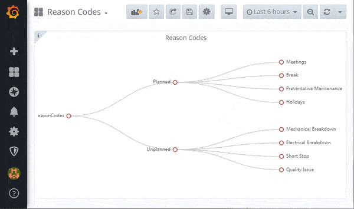
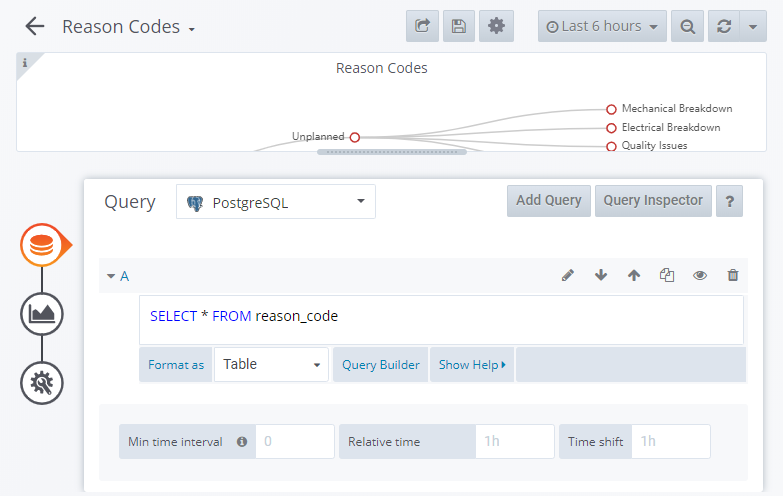

# Reason Codes Tree Panel

> Libre panel for Create, Read, Update and Delete of Downtime Reasons

This panel gives users the ability to visualize the enterprise downtime categories and reasons. By long clicking objects users can create, read, update and delete categories and reasons in the tree. This panel is part of [Libre](https://github.com/Spruik/Libre) suite of Grafana plugins and dashbaords. Downtime reasons can be classified against equipment when the machine reports a downtime state. This plugin interfaces to a no security json rest api for equipment running on the same grafana server. This panel is targeted at Grafana v6.x.x only.

Downtime reasons objects have 3 properties.

1. category_id - Name of the category
2. reason_id - Name of the reason
3. parent_reason_id - Name of the parent reason



## Installation

The easiest way to get started with this plugin is to [download the latest release](https://github.com/Spruik/Libre-Reason-Codes-CRUD-Tree-Chart-Panel/releases/latest/download/libre-reason-codes-crud-tree-chart-panel.zip), unzip into grafana plugin directory and restart grafana.

Download the latest release

```shell
$ wget https://github.com/Spruik/Libre-Reason-Codes-CRUD-Tree-Chart-Panel/releases/latest/download/libre-reason-codes-crud-tree-chart-panel.zip
Resolving github.com (github.com)... 140.82.114.4
...
2020-06-24 20:47:59 (1.08 MB/s) - 'libre-reason-codes-crud-tree-chart-panel.zip' saved [90150]
```

Unzip into your Grafana plugin directory

```shell
$ unzip libre-reason-codes-crud-tree-chart-panel.zip -d /var/lib/grafana/plugins
Archive: libre-reason-codes-crud-tree-chart-panel.zip
...
inflating: /var/lib/grafana/libre-reason-codes-crud-tree-chart-panel/utils.js.map
```

Restart Grafana

```shell
$ service grafana-server restart
 * Stopping Grafana Server
 * Starting Grafana Server
```

## Usage

In order to get the most out of this panel:

1. Add a *Table* metric to query operations. For example `SELECT * FROM reason-code`. This panel expects an id, name and sequence column.



2. Add a tooltip to inform users to long click to add, edit and delete nodes in their enterprise

| Long click to add/edit/remove node.

### Add

Long click the parent node and click add child. Provide a name and submit.

### Update

Long click the node and select update. Update the name and submit.

### Delete

Long click the node and select delete. This will delete any child nodes.

## Developing

### Getting Started

A docker-compose and grunt script is provided in order to quickly evaluate source code changes. This requires

Prerequisites

- docker (>= 18 required)
- docker-compose (>= 1.25 required)
- node (>= 12 required)
- npm (>= 6 required)

Start by cloning this repository

```shell
~/
$ git clone https://github.com/Spruik/Libre-Reason-Codes-CRUD-Tree-Chart-Panel
Cloning into 'Libre-Reason-Codes-CRUD-Tee-Chart-Panel'...
remote: Enumerating objects: 46, done.
remote: Counting objects: 100% (46/46), done.
remote: Compressing objects: 100% (31/31), done.
remote: Total 46 (delta 13), reused 46 (delta 13), pack-reused 0
Unpacking objects: 100% (46/46), done.
```

Enter project and install dependencies

```shell
$ cd ./Libre-Reason-Codes-CRUD-Tee-Chart-Panel
~/Libre-Reason-Codes-CRUD-Tee-Chart-Panel
$ npm install
...
added 714 packages from 399 contributors and audited 719 packages in 11.871s
found 42 vulnerabilities (11 low, 6 moderate, 25 high)
  run `npm audit fix` to fix them, or `npm audit` for details
```

Install Grunt globally

```shell
$ npm install grunt -g
C:\Users\user\AppData\Roaming\npm\grunt -> C:\Users\user\AppData\Roaming\npm\node_modules\grunt\bin\grunt
+ grunt@1.1.0
updated 1 package in 1.364s
```

Run grunt to build the panel

```shell
$ grunt
Running "clean:0" (clean) task
>> 1 path cleaned.

Running "clean:1" (clean) task
>> 1 path cleaned.

Running "copy:src_to_dist" (copy) task
Created 3 directories, copied 8 files

Running "copy:readme" (copy) task
Created 1 directory, copied 10 files

Running "copy:echarts_libs" (copy) task
Copied 1 file

Running "copy:pluginDef" (copy) task
Copied 1 file

Running "babel:dist" (babel) task

Done, without errors.

```

Start docker-compose.dev.yml detached

```shell
~/Libre-Reason-Codes-CRUD-Tee-Chart-Panel
$ docker-compose -f docker-compose.dev.yml up -d
Starting libre-reason-codes-crud-tree-chart-panel_postgres_1
Starting libre-reason-codes-crud-tree-chart-panel_postrest_1
Starting libre-reason-codes-crud-tree-chart-panel_simulator_1
Starting libre-reason-codes-crud-tree-chart-panel_grafana_1
```

Run grunt watch to recompile on change

```shell
~/Libre-Reason-Codes-CRUD-Tee-Chart-Panel
$ grunt watch
Running "watch" task
Waiting...
```

Open your favourite editor and start editing ./src files. The grunt watch task will detect this and recompile the panel. Use your favourite web browser and point to http://localhost:3000 login and create a dashboard with this panel. Your browser will need to be refreshed to reflect your changes to this panel, ensure your browser isn't caching files.

### Building

Prerequisites

- node (>= 12 required)
- npm (>= 6 required)

Build panel and zip into archive

```shell
~/Libre-Reason-Codes-CRUD-Tee-Chart-Panel
$ grunt build
Running "clean:0" (clean) task
>> 1 path cleaned.

Running "clean:1" (clean) task
>> 0 paths cleaned.

Running "clean:0" (clean) task
>> 0 paths cleaned.

Running "clean:1" (clean) task
>> 0 paths cleaned.

Running "copy:src_to_dist" (copy) task
Created 3 directories, copied 8 files

Running "copy:readme" (copy) task
Created 1 directory, copied 10 files

Running "copy:echarts_libs" (copy) task
Copied 1 file

Running "copy:pluginDef" (copy) task
Copied 1 file

Running "babel:dist" (babel) task

Running "compress:main" (compress) task
>> Compressed 41 files.

Done, without errors.

```

Find a completed build of this panel in the root directory named `libre-reason-codes-crud-tree-chart-panel.zip`.

## Contributing

For any issue, there are fundamentally three ways an individual can contribute:

- By opening the issue for discussion: For instance, if you believe that you have uncovered a bug in, creating a new issue in the [GitHub issue tracker](https://github.com/Spruik/Libre-Reason-Codes-CRUD-Tree-Chart-Panel/issues) is the way to report it.
- By helping to triage the issue: This can be done either by providing supporting details (a test case that demonstrates a bug), or providing suggestions on how to address the issue.
- By helping to resolve the issue: Typically, this is done either in the form of demonstrating that the issue reported is not a problem after all, or more often, by opening a Pull Request that changes some bit of something in the panel in a concrete and reviewable manner.

## Change log

- 1.0.1 Documentation Updates
  - Fix subtitle and project path
  - Expose dev simulator ui
  - Remove unused grunt config

- 1.0.0 Initial Public Release
